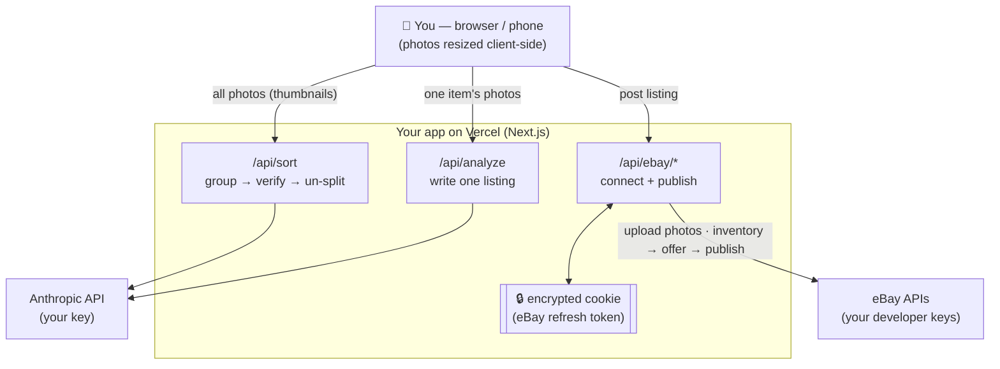

# Listing Writer 🪄

A free, open-source web app for resellers. **Dump in a pile of item photos →
it sorts them into separate items → writes a full eBay listing for each →
posts them to eBay.** Runs as your own private website on Vercel; works on your
computer and your phone.

It's **bring-your-own-keys**: you plug in your own Anthropic (AI) key and your
own eBay developer keys, so you're in full control and there's no middleman.

---

## What it does

- 📸 Upload a whole batch of photos at once
- 🔀 Auto-sorts them into separate items (group → verify → un-split)
- 🏷️ Assigns bin/SKU codes so you can find items later (e.g. `K42-A`, `K42-B`)
- 🤖 Writes a title, description, item specifics, condition, and suggested price
- ✍️ Everything is editable before you post
- 🚀 Posts straight to eBay — one item or the whole batch
- 📋 Or export everything as CSV / JSON
- 🔒 Your keys live in environment variables, never in the code

---

## What you'll need (all free to start)

1. **An Anthropic API key** — the AI that writes listings. Get one at
   <https://console.anthropic.com/> (you pay Anthropic per use; pennies per item).
2. **An eBay developer keyset** — to post listings. Free at
   <https://developer.ebay.com/>. You'll need the **App ID**, **Cert ID**, and a
   **RuName** (explained below). *Only needed for posting — sorting and writing
   work without it.*
3. **A Vercel account** — free hosting. <https://vercel.com/>
4. **Node.js** installed on your computer — <https://nodejs.org/> (the "LTS" version).

> There are two ways to set this up. **Not a coder? Use the Quick Start.**
> Comfortable in a terminal? Skip to *Setup for developers*.

---

## 🚀 Quick Start (no coding required)

You can get your own copy running without ever opening a terminal.

**1. Make your free accounts and grab your keys.**
   - Anthropic key at <https://console.anthropic.com/> → "API Keys" → create one (starts with `sk-ant-`).
   - eBay developer keyset at <https://developer.ebay.com/> (do this part later if you only want to write listings, not post them).
   - A Vercel account at <https://vercel.com/> — sign up **with GitHub** (it'll make a free GitHub account too if you don't have one).

**2. Deploy your own copy in a few clicks.**
   Click the button (it copies this project to your own GitHub and deploys it on Vercel):

   [](https://vercel.com/new/clone?repository-url=https://github.com/ashnicholes-droid/hahm-ebay-lister)

   When Vercel asks for **Environment Variables**, set **both** of these:
   - `ANTHROPIC_API_KEY` — your Anthropic key (starts with `sk-ant-`).
   - `APP_SECRET` — any access code you make up (a memorable phrase works). A
     deployed app **won't run without this**: it stops strangers from spending
     your Anthropic credits, and every AI action returns an error until it's set.

   (You can add the eBay variables later.) Click **Deploy** and wait about a
   minute — you'll get a web address like `https://your-app.vercel.app`.

**3. Bookmark your app** on your computer and add it to your phone's home
   screen. You can start sorting and writing listings immediately.

**4. To enable posting to eBay** (optional), follow *Set up eBay posting* below
   using your new web address, then add the eBay values in
   **Vercel → your project → Settings → Environment Variables** and redeploy.

That's it — no terminal, no code editing. Everything else below is for people
who want to run it locally or tinker.

---

## Setup for developers (command line)

### 1. Get the code
```bash
git clone https://github.com/ashnicholes-droid/hahm-ebay-lister.git
cd hahm-ebay-lister
npm install
```

### 2. Try it locally (optional)
Create a file called `.env.local` (copy from `.env.example`) and add at least
your Anthropic key:
```bash
cp .env.example .env.local
# then edit .env.local and set ANTHROPIC_API_KEY=sk-ant-...
npm run dev
```
Open <http://localhost:3000>. You can sort and write listings right away.
(eBay posting needs the eBay setup below + a deployed URL.)

### 3. Deploy to Vercel
The easiest path:
```bash
npm i -g vercel     # one time
vercel login        # one time
vercel --prod       # deploys; gives you a URL like https://your-app.vercel.app
```
Then add your environment variables in the Vercel dashboard
(**Project → Settings → Environment Variables**) — see the full list below —
and redeploy with `vercel --prod`.

> Prefer no terminal? You can also push this repo to GitHub and import it at
> vercel.com → "Add New Project", then add the env vars there.

### 4. Set up eBay posting (optional, for the "Post to eBay" button)
1. At <https://developer.ebay.com/> create a **Production keyset**. Note the
   **App ID (Client ID)** and **Cert ID (Client Secret)**.
2. Under that keyset → **User Tokens** → **Add eBay Redirect URL (RuName)**.
   Set, using your deployed URL:
   - **Auth accepted URL:** `https://your-app.vercel.app/api/ebay/callback`
   - **Auth declined URL:** `https://your-app.vercel.app/?ebay=declined`
   - **Privacy policy URL:** `https://your-app.vercel.app/privacy`
   - Choose **OAuth** (not Auth'n'Auth).
3. Copy the generated **RuName** — the short identifier (like `Name-XXXX-XXXX-XXXX`),
   **not** the long "eBay Production Sign In (OAuth)" URL shown on the same page.
4. Put all the values into Vercel's env vars (below) and redeploy.
5. On the live site, click **Connect eBay**, approve on eBay, and paste the URL
   from eBay's confirmation page back into the app. Done (lasts ~18 months).

> **"Marketplace account deletion" compliance.** When you create a production
> keyset, eBay flags it **"not compliant"** and asks for a *Marketplace account
> deletion/closure notification endpoint*. This app stores **no** eBay user data on
> a server — your token lives only in an encrypted cookie in your own browser — so
> you don't need an endpoint. Instead, take eBay's exemption: in the developer
> portal under *Alerts & Notifications → Marketplace account deletion*, toggle ON
> **Exempted from Marketplace Account Deletion / Not persisting eBay data** and
> submit it. (Describe your setup honestly — eBay penalizes false exemptions.) Do
> this **before** your first production API call. Only if eBay won't accept the
> exemption do you need to host an endpoint.

---

## Environment variables

| Variable | Required | What it is |
|---|---|---|
| `ANTHROPIC_API_KEY` | ✅ | Your Anthropic API key (writes the listings) |
| `APP_SECRET` | ✅ for deployed apps | Access code protecting the AI endpoints so strangers can't spend your Anthropic credits. **A deployed (production) app fails closed without it** — every AI route returns an error until it's set. Asked for once per device, then remembered. Optional only for local dev. |
| `EBAY_CLIENT_ID` | for posting | eBay App ID |
| `EBAY_CLIENT_SECRET` | for posting | eBay Cert ID |
| `EBAY_RU_NAME` | for posting | Your eBay RuName — the short `Name-XXXX-XXXX-XXXX` identifier, **not** the long "Sign In (OAuth)" URL |
| `SESSION_SECRET` | for posting | Random string to encrypt your eBay token. Generate: `node -e "console.log(require('crypto').randomBytes(32).toString('hex'))"` |
| `APP_URL` | for posting | Your deployed URL, e.g. `https://your-app.vercel.app` |
| `EBAY_LOCATION_POSTAL_CODE` | optional | Your ZIP (only used once to create an eBay inventory location) |
| `EBAY_DEFAULT_PACKAGE_WEIGHT_OZ` | optional | Default package weight in ounces (16 = 1 lb) sent to eBay so **calculated-shipping** policies can publish (avoids eBay error 25020). Editable per listing on eBay. |
| `EBAY_DEFAULT_PACKAGE_LENGTH_IN` / `_WIDTH_IN` / `_HEIGHT_IN` | optional | Default package dimensions in inches (defaults 12 × 9 × 3). |

**Never commit real keys.** `.env.local` is gitignored; production keys live in
Vercel only.

---

## How it works (for the curious)



- **Frontend** (`app/`): the upload → sort → review → write → post wizard.
  Photos are shrunk in your browser before upload.
- **`/api/sort`**: groups photos into items (AI), with verify + un-split passes.
- **`/api/analyze`**: writes a listing for one item from its photos.
- **`/api/ebay/*`**: OAuth connect (encrypted-cookie token) + the
  inventory→offer→publish flow, with recovery for eBay's category/aspect quirks.
- **Stack**: Next.js (App Router) + TypeScript, deployed on Vercel. Nothing is
  stored server-side; photos are used to build listings and discarded.

---

## Costs

- **Anthropic**: a few cents per item (sorting + writing). You set your own key.
- **eBay**: normal eBay selling fees apply to listings you post.
- **Vercel**: free Hobby tier is plenty for personal use.

---

## License

**Functional Source License (FSL-1.1-MIT)** — see [LICENSE](LICENSE).

In plain English: **free to use, modify, and self-host** — including for your
own reselling business. The one thing you *can't* do is sell this software or
offer it as a competing paid product/service. Two years after each release, that
restriction lifts and it becomes plain MIT. Use it, fork it, share it — just
don't resell it.
